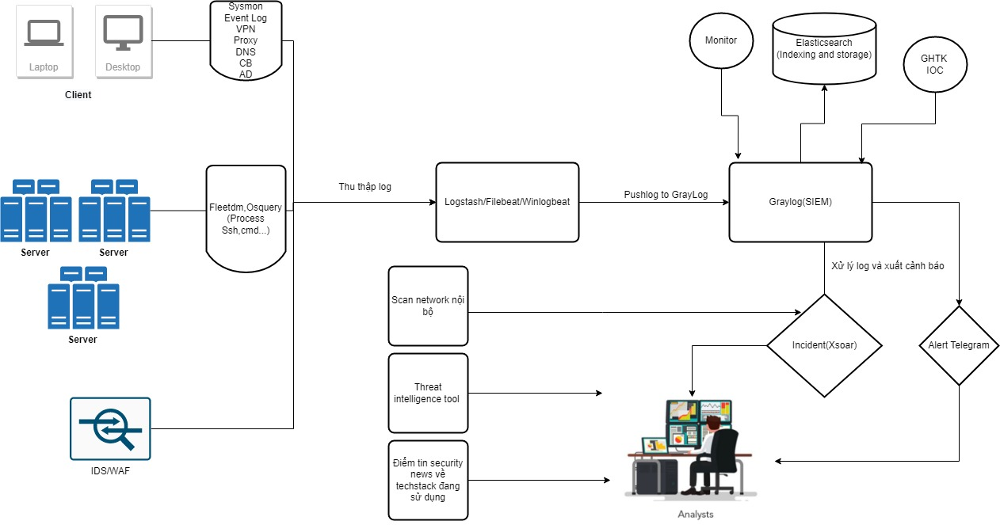

# 🔴SOC-GHTK
This is a Project Designed for Security Analysts at Giao Hang Tiet Kiem JSC (GHTK)

<ins> **NOTE - This is an Ongoing Project and the repo will be updated as we work on the new additions.** </ins>

This Projects serves below usecases:
 - **Collect Data** to a Single Place.
 - **Normalize** and **Parse Data**
 - **Visualize Data** and prepare meaningful Security Analytics
 - Create **Incidents/Cases** out of Security Alerts identified based on collected data/logs
 - **Automate** process of Threat Hunt, Creation of actionable Playbooks, SOC data Analytics
 - **Automate** the process of analsis observables they have collected, **at scale, by querying a single tool** instead of several
 - Actively respond to threats and interact with the constituency and other teams
 - Scan internal network regularly
 - **Enrich** Data feeds with Open Source Threat Intelligence Platform

# ☸Architecture-Diagram(Ongoing):

  

# ☸SOC Techstack:
In GHTK we use
 - **Elastic SIEM**: Open source SIEM platform powered by ElasticSearch, Logstash, Kibana
	- Official GitRepo of Logstash is **[HERE](https://github.com/elastic/logstash)**
	- Official GitRepo of Elasticsearch is **[HERE](https://github.com/elastic/elasticsearch)**
	- Official GitRepo of Kibana is **[HERE](https://github.com/elastic/kibana)**
 - **Cortex-Xsoar**: [Xsoar](https://github.com/demisto/content) is the industry-leading Security Orchestration, Automation & Response (SOAR) technology by Palo Alto Networks that will automate up to 95% of all response actions requiring human review and allow overloaded security teams to focus on the actions that really require their attention
	- Official GitRepo of Graylog is **[HERE](https://www.paloaltonetworks.com/cortex/cortex-xsoar)**
 - **Graylogs**: [Graylog](https://github.com/Graylog2/graylog2-server) is built to open standards for connectivity and interoperability to seamlessly collect, transfer, store, and analyze log data. Graylog is also SIEM-agnostic by design—our log streams can pass unaltered or enriched data to any application in your monitoring, alerting, and analysis stack. Your choice of scalable log management solution should let you do more with your security and performance data.
    - Official GitRepo of Graylog is **[HERE](https://www.graylog.org/)**
 - **Fleetdm**: [fleetdm](https://github.com/fleetdm/fleet) State of the art host monitoring platform tailored for security experts. Leveraging Facebook's battle-tested osquery project, Fleetdm delivers continuous updates, features and fast answers to big questions.
	- Official GitRepo of Fleetdm is **[HERE](https://fleetdm.com/)**
 - **Osquery**: [Osquery](https://osquery.io/) Easily ask questions about your Linux and macOS infrastructure using a SQL-like query language; the provided incident-response pack helps you detect and respond to breaches.
	- Official GitRepo of Fleetdm is **[HERE](https://github.com/osquery/osquery)**
 - **Sysmon**: [Sysmon](https://docs.microsoft.com/en-us/sysinternals/downloads/sysmon) System Monitor (Sysmon) is a Windows system service and device driver that, once installed on a system, remains resident across system reboots to monitor and log system activity to the Windows event log. It provides detailed information about process creations, network connections, and changes to file creation time. By collecting the events it generates using Windows Event Collection or SIEM agents and subsequently analyzing them, you can identify malicious or anomalous activity and understand how intruders and malware operate on your network.
	- Official GitRepo of Sysmon is **[HERE](https://github.com/olafhartong/sysmon-modular)**
 - **Carbon Black** [Carbon Black](https://www.vmware.com/products/carbon-black-cloud-endpoint.html) VMware Carbon Black Endpoint consolidates multiple endpoint security capabilities using one agent and console, helping you operate faster and more effectively.
	- Official GitRepo of Carbon Black is **[HERE](https://github.com/carbonblack)**
 - **Suricata**: [Suricata](https://suricata.io/) is a network IDS, IPS and NSM engine developed by the OISF and the Suricata community.
	- Official GitRepo of Suricata is **[HERE](https://github.com/OISF/suricata)**
 - **Monitotring** we use TIG Stack stand for Telegraf, InfluxDB, and Grafana, prometheus 
## Another open source we recommend with similar functionality
 - **TheHive**: [TheHive](https://thehive-project.org/) is a scalable 3-in-1 open source and free Security Incident Response Platform designed to make life easier for SOCs, CSIRTs, CERTs and any information security practitioner dealing with security incidents that need to be investigated and acted upon swiftly.
 - **Cortex**: Cortex, an open source and free software, has been created by TheHive Project for this very purpose. Observables, such as IP and email addresses, URLs, domain names, files or hashes, can be analyzed one by one or in bulk mode using a Web interface. Analysts can also automate these operations thanks to the Cortex REST API.
    - Official GitRepo of Cortex is **[HERE](https://github.com/TheHive-Project/Cortex)**
 - **MISP**: MISP is an open source software solution for collecting, storing, distributing and sharing cyber security indicators and threats about cyber security incidents analysis and malware analysis. MISP is designed by and for incident analysts, security and ICT professionals or malware reversers to support their day-to-day operations to share structured information efficiently.
   - Official GitRepo of MISP is **[HERE](https://github.com/MISP/MISP)**
 - **Shuffle**: [Shuffle](https://shuffler.io/) is an Open Source SOAR solution for making orchestration easy between security tools.
 - **Snort**: [Snort](https://www.snort.org/) is the foremost Open Source Intrusion Prevention System (IPS) in the world.
 - **Wazuh**: [Wazuh](https://wazuh.com/) is an open source security monitoring solution which collects and analyzes host security data. It is a fork of the older, better known OSSEC project.
 - **IntelOwl**: [IntelOwl](https://intelowlproject.github.io/) is an Open Source Intelligence, or OSINT solution to get threat intelligence data about a specific file, an IP or a domain from a single API at scale
 - **Atomic Red Team™**: [Atomic Red Team™](https://github.com/redcanaryco/atomic-red-team) is library of tests mapped to the MITRE ATT&CK® framework. Security teams can use Atomic Red Team to quickly, portably, and reproducibly test their environments.
 - **Twitter Bot**: We have created Twitter TI bot to collect meaningful intel about anything we care about and thus giving us the related information around them. You can find the episode [HERE](https://youtu.be/onklNNJcfDU)

# 🔽Installation-Requirements: 
## ☁Hardware Requirements: about 1500 VM
 - cortex Xsoar - Ubuntu20- 16Gb RAM, 8vcore, 500Gb Disk
 - Graylog SIEM- Ubuntu20- 16Gb RAM, 8vcore, 500Gb Disk
 - Logstash/filebeat/winlogbeat- ubuntu20- 16Gb RAM, 8vcore, 200GB Disk
## 🌏Network Rules:
| Ports | IP Ranges | Comments |
| --- | --- | --- |
| 22 | Your IP | SSH to the VMs |
| 443 | Your IP | Accessing cortex Xsoar|
| 9200 | Your IP | Accessing ElasticSearch|
| 5601 | Your IP | Accessing Kibana UI
| 9000 | Your IP | Accessing Graylog UI|
| 5044 | Your IP | Accessing Logstash|

# 🤝Contributing
We welcome your contributions. Please feel free to fork the code, play with it, make some patches and send us pull requests. 

# 🔼Enhancements:
 - As per the architecture document and Components mentioned we will keep on updating this repo with the staged implementation.
 - All of the required staged implemtation will be added in the Index page, so you can access them easily from there.

# 🙏Support
 - Please [open an issue on GitHub](https://github.com/ducna96/SOC-GHTK/issues/new) if you'd like to report a bug or request a feature.
