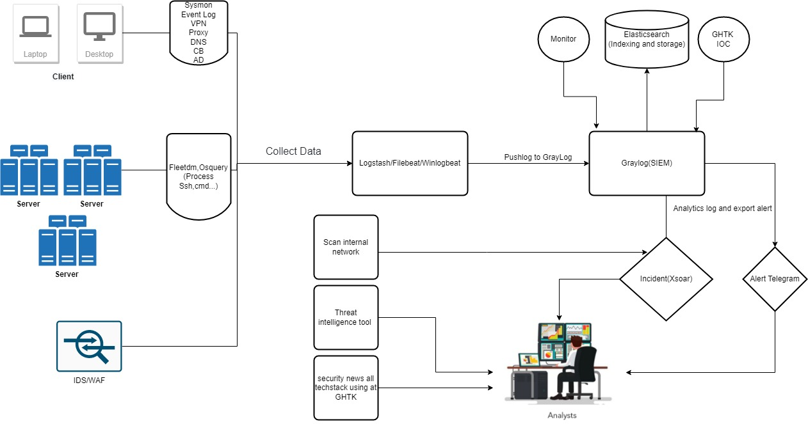

### TURN ON DARK MODE
  

## PRESENTED BY 
  

# 🔴SOC-GHTK
This is a Project Designed for Security Analysts at Giao Hang Tiet Kiem JSC (GHTK)

<ins> **NOTE - This is an Ongoing Project and the repo will be updated as we work on the new additions.** </ins>

This Projects serves below usecases:
 - **Collect Data** to a Single Place.
 - **Normalize** and **Parse Data**
 - **Visualize Data** and prepare meaningful Security Analytics
 - Create **Incidents/Cases** out of Security Alerts identified based on collected data/logs
 - **Automate** process of Threat Hunt, Creation of actionable Playbooks, SOC data Analytics
 - **Automate** the process of analsis observables they have collected, **at scale, by querying a single tool** instead of several
 - Actively respond to threats and interact with the constituency and other teams
 - **Enrich** Data feeds with Open Source Threat Intelligence Platoform

# ☸Architecture-Diagram(Ongoing):

  

## ☸Shuffle-Workflow-Implementation
 - For utilizing Shuffle workflow please first refer the installation guideline from Index.
 - Once you have your shuffle instance up and running, please refer to this video [HERE](https://youtu.be/Nb9_ahZMC5U) for full walkthrough.

# ☸Adding EDR to Stack(Ongoing):

  

## ☸EDR Implementation
 - Please Refer the installation guideline from Index.
 - Once you have your Elastic instance up and running, please refer to this video [HERE](https://youtu.be/fXLsY_eZoeE) for full walkthrough.

# ☸Components(First Phase of Implementation):
All of the components used in this projects are Open Source.
 - **Elastic SIEM**: Open source SIEM platform powered by ElasticSearch, Logstash, Kibana
 - **TheHive**: [TheHive](https://thehive-project.org/) is a scalable 3-in-1 open source and free Security Incident Response Platform designed to make life easier for SOCs, CSIRTs, CERTs and any information security practitioner dealing with security incidents that need to be investigated and acted upon swiftly.
    - Official GitRepo of TheHive is **[HERE](https://github.com/TheHive-Project/TheHive)**
 - **Cortex**: Cortex, an open source and free software, has been created by TheHive Project for this very purpose. Observables, such as IP and email addresses, URLs, domain names, files or hashes, can be analyzed one by one or in bulk mode using a Web interface. Analysts can also automate these operations thanks to the Cortex REST API.
    - Official GitRepo of Cortex is **[HERE](https://github.com/TheHive-Project/Cortex)**
 - **MISP**: MISP is an open source software solution for collecting, storing, distributing and sharing cyber security indicators and threats about cyber security incidents analysis and malware analysis. MISP is designed by and for incident analysts, security and ICT professionals or malware reversers to support their day-to-day operations to share structured information efficiently.
   - Official GitRepo of MISP is **[HERE](https://github.com/MISP/MISP)**

# ☸Additional Components(Second Phase of Implementation):
 - **Snort**: [Snort](https://www.snort.org/) is the foremost Open Source Intrusion Prevention System (IPS) in the world.
 - **Wazuh**: [Wazuh](https://wazuh.com/) is an open source security monitoring solution which collects and analyzes host security data. It is a fork of the older, better known OSSEC project.
 - **Honeypot Dionea**: [Dionaea](https://dionaea.readthedocs.io/en/latest/index.html) intention is to trap malware exploiting vulnerabilities exposed by services offered to a network, gaining a copy of the malware.
 - **Jupyter Notebook**: The Jupyter Notebook is a web-based interactive computing platform. The notebook combines live code, equations, narrative text, visualizations etc.
   - Official website of Jupyter is **[HERE](https://jupyter.org/)**
 - **IntelOwl**: [IntelOwl](https://intelowlproject.github.io/) is an Open Source Intelligence, or OSINT solution to get threat intelligence data about a specific file, an IP or a domain from a single API at scale
 - **Atomic Red Team™**: [Atomic Red Team™](https://github.com/redcanaryco/atomic-red-team) is library of tests mapped to the MITRE ATT&CK® framework. Security teams can use Atomic Red Team to quickly, portably, and reproducibly test their environments.
 - **Shuffle**: [Shuffle](https://shuffler.io/) is an Open Source SOAR solution for making orchestration easy between security tools.
 - **Twitter Bot**: We have created Twitter TI bot to collect meaningful intel about anything we care about and thus giving us the related information around them. You can find the episode [HERE](https://youtu.be/onklNNJcfDU)

## ☸Additional Components(Third Phase of Implementation):
 - **Elastic EDR**: [Elastic EDR](https://www.elastic.co/endpoint-security/) prevents ransomware and malware, detects advanced threats, and arms responders with vital context. It’s free and open, ready for every endpoint.

# 🔽Installation-Requirements: 
## ☁Hardware Requirements: 1500 VM
 - cortex Xsoar - Ubuntu20- 16Gb RAM, 8vcore, 500Gb Disk
 - Graylog SIEM- Ubuntu20- 16Gb RAM, 8vcore, 500Gb Disk
 - Logstash/filebeat/winlogbeat- ubuntu20- 16Gb RAM, 8vcore, 200GB Disk
## 🌏Network Rules:
| Ports | IP Ranges | Comments |
| --- | --- | --- |
| 22 | Your IP | SSH to the VMs |
| 443 | Your IP | Accessing cortex Xsoar|
| 9200 | Your IP | Accessing ElasticSearch|
| 5601 | Your IP | Accessing Kibana UI
| 9000 | Your IP | Accessing Graylog UI|

# 🤝Contributing
We welcome your contributions. Please feel free to fork the code, play with it, make some patches and send us pull requests. 

# 🔼Enhancements:
 - As per the architecture document and Components mentioned we will keep on updating this repo with the staged implementation.
 - All of the required staged implemtation will be added in the Index page, so you can access them easily from there.

# 🙏Support
 - Please [open an issue on GitHub](https://github.com/ducna96/SOC-GHTK/issues/new) if you'd like to report a bug or request a feature.
