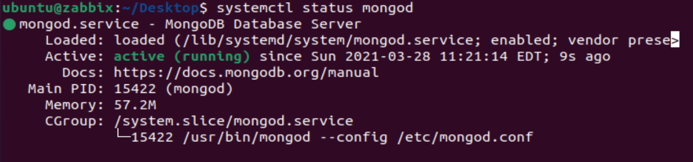
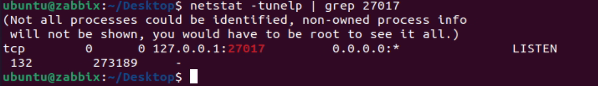

# 🤝HIRE US FOR FULL INSTALLATION🤝

Contact Info: ducna36@ghtk.co
Installation Guide(First Phase):
```sh
Contents  Collapse 
Steps to Install Graylog On Ubuntu 20.04
Step 1: Update the Ubuntu system
Step 2: Install OpenJDK on Ubuntu
Step 3: Install Elasticsearch on Ubuntu
3.1 Set Elasticsearch cluster name:
3.2 Restart the Elasticsearch service:
Step 4: Install MongoDB on Ubuntu
4.1: Import MongoDB public GPG Key
4.2: Add MongoDB 4.4 APT Repository to Ubuntu
4.3: Install MongoDB 4.4 on Ubuntu
4.4: Enable MongoDB service auto start on boot
4.5: Verify MongoDB service status
4.6: Test the connection
Step 5: Install Graylog on Ubuntu
Step 6: Configure Graylog on Ubuntu
Step 7: Start and enable Graylog service
By default, REST API will listen on:
Web interface URI will be:
Step 8: Access Graylog Web UI on Ubuntu
Home page of Graylog:
Step 9: Configure Nginx Proxy if you want to access Graylog with domain
See Also:
```
Step 1: Update the Ubuntu system
to avoid any dependency issues it is always recommended updating the system before installing any package.
```sh
$ sudo apt update
```
Step 2: Install OpenJDK on Ubuntu
Dependency on Graylog is Elasticsearch. Elasticsearch required Java (OpenJDK/Oracle Java) installed on the system. 
```sh
$ sudo apt -y install vim bash-completion apt-transport-https uuid-runtime pwgen openjdk-8-jre-headless
```
Step 3: Install Elasticsearch on Ubuntu
Graylog 3 requires Elasticsearch 6.x to work.
```sh
sudo apt update

sudo apt -y install apt-transport-https

wget -qO - https://artifacts.elastic.co/GPG-KEY-elasticsearch | sudo apt-key add -

echo "deb https://artifacts.elastic.co/packages/oss-6.x/apt stable main" | sudo tee -a /etc/apt/sources.list.d/elastic-6.x.list

sudo apt update

sudo apt -y install elasticsearch-oss
```
3.1 Set Elasticsearch cluster name:
```sh
sudo vim /etc/elasticsearch/elasticsearch.yml
eg:

cluster.name: graylog

action.auto_create_index: false
```
3.2 Restart the Elasticsearch service:
```sh
sudo systemctl daemon-reload

sudo systemctl enable elasticsearch.service

sudo systemctl restart elasticsearch.service
```
Step 4: Install MongoDB on Ubuntu 
4.1: Import MongoDB public GPG Key
```sh
sudo apt update

sudo apt install gnupg

wget -qO - https://www.mongodb.org/static/pgp/server-4.4.asc | sudo apt-key add -
```
4.2: Add MongoDB 4.4 APT Repository to Ubuntu
```sh
echo "deb [ arch=amd64,arm64 ] https://repo.mongodb.org/apt/ubuntu focal/mongodb-org/4.4 multiverse" | sudo tee /etc/apt/sources.list.d/mongodb-org-4.4.list
sudo apt update
```
4.3: Install MongoDB 4.4 on Ubuntu
```sh
sudo apt install -y mongodb-org
```
4.4: Enable MongoDB service auto start on boot
```sh
sudo systemctl enable --now mongod
```
4.5: Verify MongoDB service status
```sh
apt install net-tools

systemctl status mongod

netstat -tunelp | grep 27017
```
<p align="center">  </p>
<p align="center">  </p>
MongoDB config file: ‘/etc/mongod.conf’, After changes make sure you restart the MongoDB service

4.6: Test the connection
```sh
mongo --eval 'db.runCommand({ connectionStatus: 1 })'
```
If everything is working fine then you will get “ok” : 1 in above output.
<p align="center">  </p>

Step 5: Install Graylog on Ubuntu
Add Graylog repository and install graylog-server package
```sh
wget https://packages.graylog2.org/repo/packages/graylog-3.1-repository_latest.deb

sudo dpkg -i graylog-3.1-repository_latest.deb

sudo apt update

sudo apt -y install graylog-server
```
Step 6: Configure Graylog on Ubuntu
Generate admin user password with a 256-bit hash:
```sh
echo -n MyStrongPassword | sha256sum
```
Sample Output:
```sh
ubuntu@zabbix:~/Desktop$ echo -n MyStrongPassword | sha256sum
7a96004f5149811c069f40146b08cf45f45087d4530d35f7d4d88d058db9612d -
ubuntu@zabbix:~/Desktop$
```
Locate server config file and add the password to the root_password_sha2 line.
```sh
sudo vim /etc/graylog/server/server.conf 
root_password_sha2 = 
7a96004f5149811c069f40146b08cf45f45087d4530d35f7d4d88d058db9612d
```
Now generate and set password for password_secret in file ‘/etc/graylog/server/server.conf’
```sh
sudo apt-get install pwgen

pwgen -N 1 -s 96
```
Sample Output:
```sh
ubuntu@zabbix:~/Desktop$ pwgen -N 1 -s 96
v7ricMclUDeQvUAJ7FZmE5aKXm1ibKvS4yaBRJuwMeThf9V2S7Pxc104chaGErisAAxjuPzAfrtBIqkaDmBOhOuNyvfdbqet
ubuntu@zabbix:~/Desktop$
```
```sh
$ sudo vim /etc/graylog/server/server.conf
password_secret = v7ricMclUDeQvUAJ7FZmE5aKXm1ibKvS4yaBRJuwMeThf9V2S7Pxc104chaGErisAAxjuPzAfrtBIqkaDmBOhOuNyvfdbqet
```
<p align="center">  </p>
Step 7: Start and enable Graylog service
```sh
sudo systemctl enable graylog-server.service
sudo systemctl start graylog-server.service
```
<p align="center">  </p>
By default, REST API will listen on:
```sh
rest_listen_uri = http://127.0.0.1:9000/api/
```
Web interface URI will be: 
```sh
web_listen_uri = http://127.0.0.1:9000/
```
Web interface URI can be changed to Server IP.

Step 8: Access Graylog Web UI on Ubuntu 
```sh
http://ubuntuip_or_hostname:9000
```
<p align="center">  </p>
Login to the server with the credentials as mentioned in steps 6.
```sh
Default user: admin
Password: MyStrongPassword
```
Home page of Graylog:
<p align="center">  </p>
(Below steps is Optional) – If you want to access Graylog with the domain then you need Nginx proxy as mention in steps 9.

Step 9: Configure Nginx Proxy if you want to access Graylog with domain
Prerequisite to install Nginx on Ubuntu system
Here is the sample Nginx configuration without https (localaccess)
```sh
$ cat /etc/nginx/conf.d/graylog.conf 
server
{
server_name graylogserver.sysadminxpert.com;

location / {
proxy_set_header Host $http_host;
proxy_set_header X-Forwarded-Host $host;
proxy_set_header X-Forwarded-Server $host;
proxy_set_header X-Forwarded-For $proxy_add_x_forwarded_for;
proxy_set_header X-Graylog-Server-URL http://$server_name/api;
proxy_pass http://127.0.0.1:9000;
}
}
```
```sh
sudo systemctl restart nginx
```
Access Graylog web user interface on http://domain.com

Login to the server with the credentials as mentioned in steps 6.

You have successfully installed and configure Graylog server.

This is the End of a tutorial, How To Install Graylog On Ubuntu 20.04.